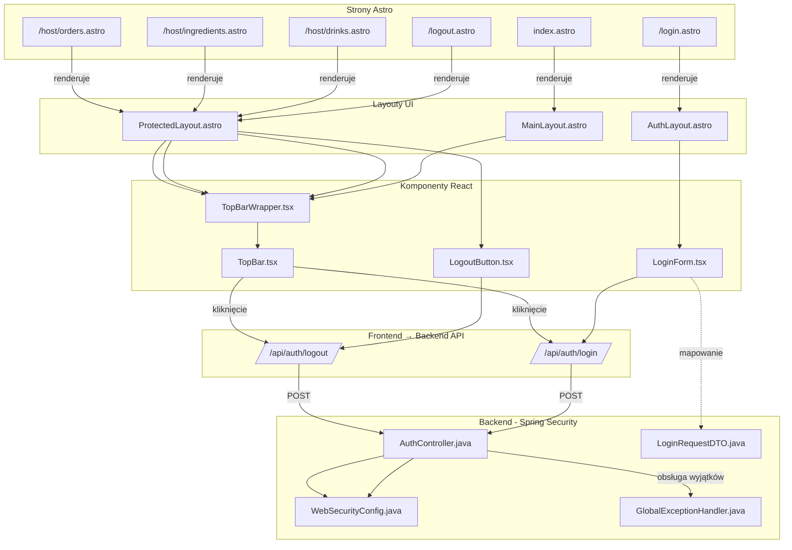

```mermaid
flowchart TD
    subgraph "Layouty UI"
        AL["AuthLayout.astro"]
        PL["ProtectedLayout.astro"]
        ML["MainLayout.astro"]
    end

    subgraph "Strony Astro"
        LoginPage["/login.astro"]
        LogoutPage["/logout.astro"]
        HomePage["index.astro"]
        DrinksPage["/host/drinks.astro"]
        IngredientsPage["/host/ingredients.astro"]
        OrdersPage["/host/orders.astro"]
    end

    subgraph "Komponenty React"
        LF["LoginForm.tsx"]
        LB["LogoutButton.tsx"]
        TW["TopBarWrapper.tsx"]
        TB["TopBar.tsx"]
    end

    subgraph "Frontend → Backend API"
        LoginAPI[/"/api/auth/login"/]
        LogoutAPI[/"/api/auth/logout"/]
    end

    subgraph "Backend - Spring Security"
        AC["AuthController.java"]
        WSC["WebSecurityConfig.java"]
        DTO["LoginRequestDTO.java"]
        EXC["GlobalExceptionHandler.java"]
    end

%% Przepływ
    LoginPage -->|renderuje| AL --> LF --> LoginAPI
    LogoutPage -->|renderuje| PL --> LB --> LogoutAPI
    HomePage -->|renderuje| ML --> TW --> TB
    DrinksPage -->|renderuje| PL --> TW
    IngredientsPage -->|renderuje| PL --> TW
    OrdersPage -->|renderuje| PL --> TW
    LoginAPI -->|POST| AC --> WSC
    LogoutAPI -->|POST| AC --> WSC
    LF -.->|mapowanie| DTO
    AC -->|obsługa wyjątków| EXC
    TB -->|kliknięcie| LoginAPI
    TB -->|kliknięcie| LogoutAPI
```